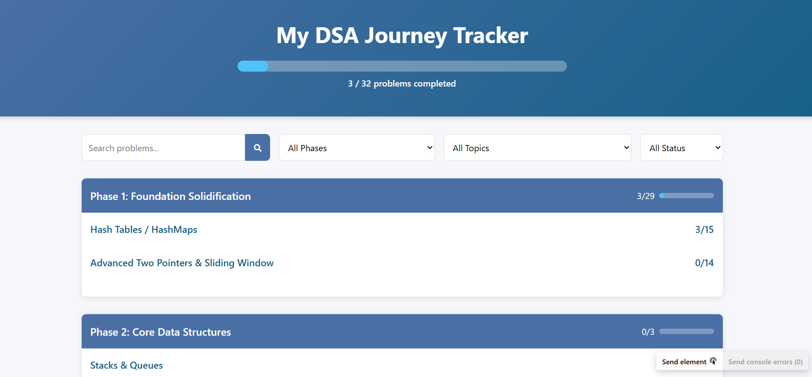

# DSA Journey Tracker


A comprehensive web application to track your Data Structures and Algorithms learning journey. Keep track of problems solved, add notes, record time and space complexity, and visualize your progress through your DSA study plan.

<div align="center">
  
</div>

## 🌟 Features

- **📊 Progress Tracking**: Visual progress bars show completion rates for overall journey, phases, and topics
- **🔄 Problem Status Management**: Mark problems as "Not Started", "In Progress", or "Completed"
- **📝 Detailed Problem Records**: 
  - Add personal notes for each problem
  - Record time and space complexity of your solutions
  - Track completion dates
- **🔍 Search & Filter System**: Find specific problems or filter by phase, topic, and status
- **💾 Persistent Storage**: All progress is automatically saved in your browser's localStorage
- **📱 Responsive Design**: Works on desktop and mobile devices


## 📋 DSA Study Plan

The tracker includes a comprehensive DSA study plan organized into:

- **Phase 1: Foundation Solidification**
  - Hash Tables / HashMaps
  - Advanced Two Pointers & Sliding Window

- **Phase 2: Core Data Structures**
  - Stacks & Queues
  - Linked Lists
  - Trees - Binary Trees
  - Binary Search Trees

## 🛠️ Installation & Setup

### Method 1: Direct Download
1. Download or clone this repository
2. Open `index.html` in your web browser
3. Start tracking your DSA journey!

### Method 2: GitHub Pages Deployment
1. Fork this repository
2. Enable GitHub Pages in your repository settings
3. Your tracker will be available at `https://github.com/SohanAri/dsa-tracker`

## 💻 Usage Guide

1. **Browse Problems**: 
   - Click on phase headers to expand/collapse phases
   - Click on topic headers to expand/collapse topics

2. **Update Problem Status**:
   - Click on any problem card to open the details modal
   - Change status, add notes, record complexity, set completion date
   - Click "Save" to update your progress

3. **Search & Filter**:
   - Use the search bar to find problems by name
   - Use the dropdown filters to filter by phase, topic, or status

4. **Track Progress**:
   - View your overall progress at the top of the page
   - Each phase and topic shows individual progress statistics

## 💾 Data Storage

Your progress data is stored using the browser's localStorage:

- **Automatic Saving**: Data is saved whenever you update a problem
- **Persistence**: Data remains even when you close the browser or restart your computer
- **Local Only**: Data is stored only on your current device and browser
- **Storage Limits**: Typically 5-10MB (more than enough for tracking hundreds of problems)
- **Data Clearing**: Clearing browser data/cache will reset your progress

## 🔧 Customization

You can customize the problem set by editing the `js/data.js` file:

```javascript
const dsaData = {
    phases: [
        {
            id: "phase1",
            title: "Phase 1: Foundation Solidification",
            topics: [
                {
                    id: "hash-tables",
                    title: "Hash Tables / HashMaps",
                    subtopics: [
                        {
                            title: "Core Understanding Problems",
                            problems: [
                                {
                                    id: "two-sum",
                                    title: "Two Sum",
                                    leetcodeUrl: "https://leetcode.com/problems/two-sum/",
                                    // ...
                                },
                                // More problems...
                            ]
                        },
                        // More subtopics...
                    ]
                },
                // More topics...
            ]
        },
        // More phases...
    ]
};
```

## 🔄 Future Enhancements

- [ ] Data export/import functionality
- [ ] Dark mode support
- [ ] Custom problem addition
- [ ] Code snippet storage
- [ ] Integration with LeetCode API
- [ ] Difficulty ratings and sorting

## 🧰 Technologies Used

- **HTML5** - Structure
- **CSS3** - Styling with custom variables for theming
- **JavaScript** - Dynamic functionality and localStorage management
- **Font Awesome** - Icons
